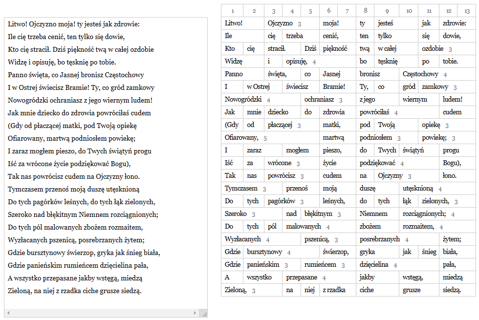

# Vyershark

Divides Polish words into syllables, and displays a realtime tabular preview of
a poem's structure. For example, Adam Mickiewicz's famous lines can be clearly
seen to follow the famous traditional trzynastozgłoskowiec structure.

## Live demo

Here: [aleshkev.github.io/vyershark](aleshkev.github.io/vyershark).

## Implementation details

The algorithm is pretty naive, inspired partially by the rules Polish Wiktionary
uses to convert words to IPA automatically. It turns out, the vast majority of
traditional words have simple letter-vowel correspondence. The task is made even
simpler by the decision not to divide words into syllables, but to count
them.

I'm like how the look of the page turned out, the minimal amount of CSS made it
look
very minimal and clean.
